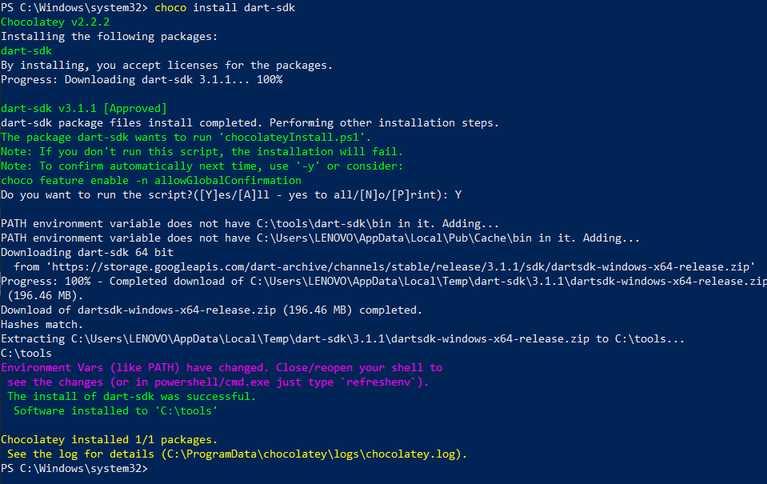

# Learn Dart and Flutter
Voici une feuille de route d'apprentissage pour Dart et Flutter. Cette feuille de route est divisée en étapes progressives, en commençant par les bases de Dart et en progressant jusqu'à la création d'applications mobiles complètes avec Flutter.

<strong>Objectif :<strong> Comprendre les bases de Dart, le langage de programmation utilisé avec Flutter.

## Étape 0 : Installation de l'envireonement

Comprendre ce qu'est Dart et pourquoi il est utilisé avec Flutter.
Installer Dart sur ton système.

1. Installer [https://chocolatey.org/install](https://chocolatey.org/install)
2. Installer dart en exécutant : 

2.1) Sous windows 
```bash
choco install dart-sdk
```
👇🏽👇🏽 <br>


2.2) Sous Linux 
```bash
 sudo apt-get update
 sudo apt-get install apt-transport-https
 wget -qO- https://dl-ssl.google.com/linux/linux_signing_key.pub | sudo gpg --dearmor -o /usr/share/keyrings/dart.gpg
 echo 'deb [signed-by=/usr/share/keyrings/dart.gpg arch=amd64] https://storage.googleapis.com/download.dartlang.org/linux/debian stable main' | sudo tee /etc/apt/sources.list.d/dart_stable.list
```
puis 
```bash
 sudo apt-get update
 sudo apt-get install dart
```
Modifier PATH pour accéder à tous les binaires Dart
```bash
export PATH="$PATH:/usr/lib/dart/bin"
```
## Étape 1 : Apprendre Dart
### Introduction à Dart :
<!-- Syntaxe de base :
Apprendre les concepts de base : variables, types de données, opérateurs.
Utiliser les structures de contrôle : if, else, while, for.
Fonctions :

Définir et appeler des fonctions.
Comprendre les paramètres de fonction et les valeurs de retour.
Classes et objets :

Apprendre à créer des classes et des objets en Dart.
Comprendre l'encapsulation, l'héritage et la polymorphie.
Collections :

Utiliser des listes, des ensembles et des cartes.
Apprendre à itérer à travers les collections.
Gestion des erreurs :

Comprendre la gestion des erreurs et les exceptions en Dart.
Programmation asynchrone :

Apprendre à utiliser les futures et les streams pour la programmation asynchrone. -->

| Chap | Description |
| -------- | ----------- | 
| [0x00-hello_world](https://github.com/alban-okoby/learn-all-things-you-need/tree/main/dart/hello-world) | Say hello  |
.
